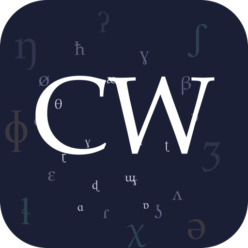

# Conlang Workbench



A professional conlang workbench for phonology, lexicon, grammar, and culture design.

---

## Overview

Conlang Workbench is a Flutter desktop application for creating constructed languages. It provides an integrated environment covering the full language-design workflow: phoneme inventories, phonotactics, a morphology pattern engine, lexicon management, grammar systems, and more. Each constructed language lives in its own `.conlang` project file (backed by SQLite), keeping your work self-contained and portable.

## Features

### Phonology
- Phoneme inventory editor with IPA chart and audio playback for every symbol
- Phonotactic DSL: define syllable shapes and legal consonant clusters
- Phonological rewrite rules: context-sensitive transformations
- Word generator: produce random native-looking words from your phonotactics

### Lexicon
- Root and derived-word dictionaries with full definition support
- Morphological pattern mini-language supporting agglutinative, fusional, Semitic root-and-pattern, and analytic strategies
- Swadesh 207-item list and Conlanger's Thesaurus integration for concept lookup
- Anki flashcard export for vocabulary drilling

### Grammar
- Parts of speech with customizable categories
- Declension and conjugation systems with slot-based paradigm tables
- Flexible modality: mix morphological and analytic (particle/auxiliary) strategies per grammatical feature
- Paradigm chart generation and export

### Glossary
- Built-in searchable linguistics glossary covering terminology used throughout the app

### Multi-project
- Each language lives in its own `.conlang` project file — open multiple, switch freely

## Installation

### macOS (pre-built)

1. Download the latest `Conlang-Workbench-*-macos.zip` from [GitHub Releases](../../releases).
2. Unzip and drag `Conlang Workbench.app` to your `Applications` folder.
3. On first launch, right-click the app icon and choose **Open** to bypass Gatekeeper (the app is unsigned).

### Build from source

**Requirements:** Flutter SDK 3.10 or later, macOS with Xcode command-line tools installed.

```bash
git clone https://github.com/neosapien/conlang.git
cd conlang
flutter pub get
dart run build_runner build --delete-conflicting-outputs
flutter build macos --release
```

The built app is at `build/macos/Build/Products/Release/Conlang Workbench.app`.

Alternatively, use the provided build script to produce a distributable zip:

```bash
bash scripts/build-release-macos.sh
```

## Development

```bash
# Run in debug mode
flutter run -d macos

# Regenerate code (Drift database, Riverpod providers)
dart run build_runner build --delete-conflicting-outputs
```

## Tech Stack

Flutter, Drift (SQLite ORM), Riverpod (state management), PetitParser (DSL parsing), just_audio (IPA audio playback).

## License

MIT — see [LICENSE](LICENSE).
